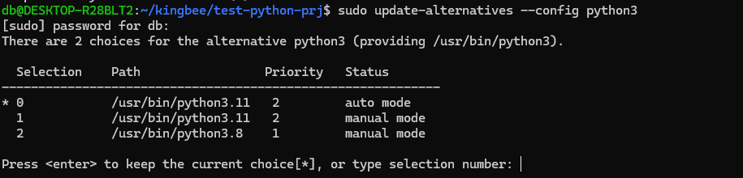
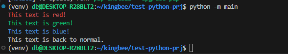

## Instal python enviroment on WSL2 (Ubuntu 20.4)
### Upgrade Python version (3.10 -> 3.11)
```
# Add repository for python distribution download
sudo add-apt-repository ppa:deadsnakes/ppa

# Update & upgrade the repositories
sudo apt update
sudo apt upgrade

# Install python 3.11
sudo apt-get install python3.11

# python3 shows 3.8 and python3.11 shows 3.11 as version
python3 --version
python3.11 --version

#choose 2 for python 3.11
sudo update-alternatives --config python3

# 3.11 will be shown as version
python3 --version
```


### Install pageckage Pip and venv
```
# Pip
sudo apt install python3-pip

# Venv for python 3.11
sudo apt install python3.11-venv
```

## Check python installed is successful by create the mini project
```
# Create folder python-hello-world
mkdir python-hello-world
cd python-hello-world

# Create virtual environment
python -m venv venv

# Active venv 
source venv/bin/activate

# Colorful messsages on terminal Package
pip install colorama

# Create file main.py
touch main.py

# Run file main.py
python -m main
```



Ref: [link](https://medium.com/@milieere/the-best-local-development-environment-for-windows-set-up-in-10-mins-680ca1653608)